# Olist ERP DER

DER lógico e operacional do modelo relacional do projeto `Albertina`, organizado por domínios e com foco em rastreabilidade de integração, normalização operacional e suporte analítico.

## Legenda

- `tenant_id`: chave de segregação multi-tenant
- `olist_*_id`: chave natural externa da Olist
- `source_payload`: payload bruto ou parcial para rastreabilidade
- `raw_attributes`: atributos flexiveis ainda não totalmente normalizados

## Mermaid ER Diagram

```mermaid
erDiagram
    TENANTS {
        uuid tenant_id PK
        text tenant_code
        text tenant_name
        text status
    }

    USER_TENANTS {
        text user_id PK
        uuid tenant_id PK
        text role
    }

    SYNC_RUNS {
        uuid sync_run_id PK
        uuid tenant_id FK
        text entity_name
        text endpoint_path
        text sync_mode
        text status
    }

    API_PAYLOADS {
        uuid raw_id PK
        uuid tenant_id FK
        text entity_name
        bigint olist_object_id
        timestamptz source_updated_at
    }

    WEBHOOK_EVENTS {
        uuid webhook_event_id PK
        uuid tenant_id FK
        text event_type
        text delivery_status
    }

    COMPANIES {
        uuid company_id PK
        uuid tenant_id FK
        bigint olist_company_id
        text legal_name
        text cnpj
    }

    OLIST_USERS {
        uuid olist_user_pk PK
        uuid tenant_id FK
        bigint olist_user_id
        text user_name
        text user_type
    }

    VENDORS {
        uuid vendor_id PK
        uuid tenant_id FK
        bigint olist_vendor_id
        text vendor_name
    }

    CONTACT_TYPES {
        uuid contact_type_id PK
        uuid tenant_id FK
        bigint olist_contact_type_id
        text type_name
    }

    CONTACTS {
        uuid contact_id PK
        uuid tenant_id FK
        bigint olist_contact_id
        uuid vendor_id FK
        uuid contact_type_id FK
        text contact_name
        text cpf_cnpj
    }

    CONTACT_PEOPLE {
        uuid contact_person_id PK
        uuid tenant_id FK
        uuid contact_id FK
        bigint olist_contact_person_id
        text person_name
    }

    ADDRESSES {
        uuid address_id PK
        uuid tenant_id FK
        uuid contact_id FK
        text address_role
        text city
        text state
    }

    CATEGORIES {
        uuid category_id PK
        uuid tenant_id FK
        bigint olist_category_id
        uuid parent_category_id FK
        text category_name
    }

    BRANDS {
        uuid brand_id PK
        uuid tenant_id FK
        bigint olist_brand_id
        text brand_name
    }

    TAG_GROUPS {
        uuid tag_group_id PK
        uuid tenant_id FK
        bigint olist_tag_group_id
        text group_name
    }

    PRODUCT_TAGS {
        uuid product_tag_id PK
        uuid tenant_id FK
        uuid tag_group_id FK
        bigint olist_product_tag_id
        text tag_name
    }

    PRODUCTS {
        uuid product_id PK
        uuid tenant_id FK
        bigint olist_product_id
        uuid category_id FK
        uuid brand_id FK
        text product_code
        text product_name
    }

    PRODUCT_VARIANTS {
        uuid product_variant_id PK
        uuid tenant_id FK
        uuid product_id FK
        bigint olist_variant_id
        text variant_name
    }

    PRODUCT_TAG_LINKS {
        uuid product_id FK
        uuid product_tag_id FK
        uuid tenant_id FK
    }

    SERVICES {
        uuid service_id PK
        uuid tenant_id FK
        bigint olist_service_id
        text service_name
    }

    PRICE_LISTS {
        uuid price_list_id PK
        uuid tenant_id FK
        bigint olist_price_list_id
        text price_list_name
    }

    PRICE_LIST_ITEMS {
        uuid price_list_item_id PK
        uuid tenant_id FK
        uuid price_list_id FK
        uuid product_id FK
        numeric unit_price
    }

    PAYMENT_METHODS {
        uuid payment_method_id PK
        uuid tenant_id FK
        bigint olist_payment_method_id
        text payment_method_name
    }

    RECEIPT_METHODS {
        uuid receipt_method_id PK
        uuid tenant_id FK
        bigint olist_receipt_method_id
        text receipt_method_name
    }

    SHIPPING_METHODS {
        uuid shipping_method_id PK
        uuid tenant_id FK
        bigint olist_shipping_method_id
        text shipping_method_name
    }

    FREIGHT_METHODS {
        uuid freight_method_id PK
        uuid tenant_id FK
        bigint olist_freight_method_id
        text freight_method_name
    }

    INTERMEDIATORS {
        uuid intermediator_id PK
        uuid tenant_id FK
        bigint olist_intermediator_id
        text intermediator_name
        text cnpj
    }

    DEPOSITS {
        uuid deposit_id PK
        uuid tenant_id FK
        bigint olist_deposit_id
        text deposit_name
    }

    STOCK_BALANCES {
        uuid stock_balance_id PK
        uuid tenant_id FK
        uuid product_id FK
        uuid deposit_id FK
        numeric physical_qty
        numeric reserved_qty
    }

    STOCK_MOVEMENTS {
        uuid stock_movement_id PK
        uuid tenant_id FK
        uuid product_id FK
        uuid deposit_id FK
        text movement_type
        numeric quantity
    }

    OPERATION_NATURES {
        uuid operation_nature_id PK
        uuid tenant_id FK
        bigint olist_operation_nature_id
        text operation_nature_name
    }

    ORDERS {
        uuid order_id PK
        uuid tenant_id FK
        bigint olist_order_id
        uuid contact_id FK
        uuid vendor_id FK
        uuid deposit_id FK
        uuid price_list_id FK
        uuid intermediator_id FK
        uuid operation_nature_id FK
        bigint order_number
        int order_status
        int order_origin
        numeric total_order_amount
    }

    ORDER_ITEMS {
        uuid order_item_id PK
        uuid tenant_id FK
        uuid order_id FK
        uuid product_id FK
        uuid service_id FK
        numeric quantity
        numeric unit_price
    }

    ORDER_MARKERS {
        uuid order_marker_id PK
        uuid tenant_id FK
        uuid order_id FK
        text marker_description
    }

    ORDER_INSTALLMENTS {
        uuid installment_id PK
        uuid tenant_id FK
        uuid order_id FK
        uuid receipt_method_id FK
        uuid payment_method_id FK
        date due_date
        numeric installment_amount
    }

    ORDER_INTEGRATED_PAYMENTS {
        uuid integrated_payment_id PK
        uuid tenant_id FK
        uuid order_id FK
        int payment_type
        numeric payment_amount
    }

    ORDER_SHIPPING {
        uuid order_shipping_id PK
        uuid tenant_id FK
        uuid order_id FK
        uuid carrier_contact_id FK
        uuid shipping_method_id FK
        uuid freight_method_id FK
        text tracking_code
    }

    ORDER_OPERATIONS {
        uuid order_operation_id PK
        uuid tenant_id FK
        uuid order_id FK
        text operation_name
        text operation_status
    }

    SHIPMENT_GROUPS {
        uuid shipment_group_id PK
        uuid tenant_id FK
        bigint olist_shipment_group_id
        text status
    }

    SHIPMENTS {
        uuid shipment_id PK
        uuid tenant_id FK
        bigint olist_shipment_id
        uuid shipment_group_id FK
        uuid order_id FK
        text status
    }

    SEPARATIONS {
        uuid separation_id PK
        uuid tenant_id FK
        bigint olist_separation_id
        uuid order_id FK
        uuid packed_by_user_id FK
        text status
    }

    SEPARATION_ITEMS {
        uuid separation_item_id PK
        uuid tenant_id FK
        uuid separation_id FK
        uuid order_item_id FK
        uuid product_id FK
        numeric quantity
    }

    INVOICES {
        uuid invoice_id PK
        uuid tenant_id FK
        bigint olist_invoice_id
        uuid order_id FK
        uuid contact_id FK
        text invoice_number
        text invoice_status
        numeric total_amount
    }

    INVOICE_ITEMS {
        uuid invoice_item_id PK
        uuid tenant_id FK
        uuid invoice_id FK
        uuid order_item_id FK
        uuid product_id FK
        uuid service_id FK
        numeric total_amount
    }

    INVOICE_MARKERS {
        uuid invoice_marker_id PK
        uuid tenant_id FK
        uuid invoice_id FK
        text marker_description
    }

    REVENUE_EXPENSE_CATEGORIES {
        uuid category_fin_id PK
        uuid tenant_id FK
        bigint olist_fin_category_id
        text category_name
        text category_kind
    }

    ACCOUNTS_RECEIVABLE {
        uuid ar_id PK
        uuid tenant_id FK
        bigint olist_ar_id
        uuid order_id FK
        uuid invoice_id FK
        uuid contact_id FK
        uuid revenue_category_id FK
        date due_date
        numeric amount
    }

    ACCOUNTS_RECEIVABLE_RECEIPTS {
        uuid ar_receipt_id PK
        uuid tenant_id FK
        uuid ar_id FK
        date receipt_date
        numeric receipt_amount
    }

    ACCOUNTS_RECEIVABLE_MARKERS {
        uuid ar_marker_id PK
        uuid tenant_id FK
        uuid ar_id FK
        text marker_description
    }

    ACCOUNTS_PAYABLE {
        uuid ap_id PK
        uuid tenant_id FK
        bigint olist_ap_id
        uuid purchase_order_id FK
        uuid contact_id FK
        uuid expense_category_id FK
        date due_date
        numeric amount
    }

    ACCOUNTS_PAYABLE_RECEIPTS {
        uuid ap_receipt_id PK
        uuid tenant_id FK
        uuid ap_id FK
        date payment_date
        numeric payment_amount
    }

    ACCOUNTS_PAYABLE_MARKERS {
        uuid ap_marker_id PK
        uuid tenant_id FK
        uuid ap_id FK
        text marker_description
    }

    CRM_STAGES {
        uuid crm_stage_id PK
        uuid tenant_id FK
        bigint olist_crm_stage_id
        text stage_name
    }

    CRM_SUBJECTS {
        uuid crm_subject_id PK
        uuid tenant_id FK
        bigint olist_subject_id
        uuid contact_id FK
        uuid crm_stage_id FK
        text subject_title
    }

    CRM_ACTIONS {
        uuid crm_action_id PK
        uuid tenant_id FK
        uuid crm_subject_id FK
        bigint olist_action_id
        text action_status
    }

    CRM_NOTES {
        uuid crm_note_id PK
        uuid tenant_id FK
        uuid crm_subject_id FK
        bigint olist_note_id
    }

    CRM_MARKERS {
        uuid crm_marker_id PK
        uuid tenant_id FK
        text marker_description
    }

    CRM_SUBJECT_MARKERS {
        uuid crm_subject_id FK
        uuid crm_marker_id FK
        uuid tenant_id FK
    }

    PURCHASE_ORDERS {
        uuid purchase_order_id PK
        uuid tenant_id FK
        bigint olist_purchase_order_id
        uuid supplier_contact_id FK
        text order_number
        numeric total_amount
    }

    PURCHASE_ORDER_ITEMS {
        uuid purchase_order_item_id PK
        uuid tenant_id FK
        uuid purchase_order_id FK
        uuid product_id FK
        numeric quantity
        numeric total_amount
    }

    PURCHASE_ORDER_MARKERS {
        uuid purchase_order_marker_id PK
        uuid tenant_id FK
        uuid purchase_order_id FK
        text marker_description
    }

    SERVICE_ORDERS {
        uuid service_order_id PK
        uuid tenant_id FK
        bigint olist_service_order_id
        uuid contact_id FK
        text order_number
        numeric total_amount
    }

    SERVICE_ORDER_ITEMS {
        uuid service_order_item_id PK
        uuid tenant_id FK
        uuid service_order_id FK
        uuid service_id FK
        numeric quantity
        numeric total_amount
    }

    SERVICE_ORDER_MARKERS {
        uuid service_order_marker_id PK
        uuid tenant_id FK
        uuid service_order_id FK
        text marker_description
    }

    TENANTS ||--o{ USER_TENANTS : scopes
    TENANTS ||--o{ SYNC_RUNS : runs
    TENANTS ||--o{ API_PAYLOADS : stores
    TENANTS ||--o{ WEBHOOK_EVENTS : receives
    TENANTS ||--o{ COMPANIES : owns
    TENANTS ||--o{ CONTACTS : owns
    TENANTS ||--o{ PRODUCTS : owns
    TENANTS ||--o{ ORDERS : owns
    TENANTS ||--o{ INVOICES : owns
    TENANTS ||--o{ ACCOUNTS_RECEIVABLE : owns
    TENANTS ||--o{ ACCOUNTS_PAYABLE : owns
    TENANTS ||--o{ CRM_SUBJECTS : owns
    TENANTS ||--o{ PURCHASE_ORDERS : owns
    TENANTS ||--o{ SERVICE_ORDERS : owns

    VENDORS ||--o{ CONTACTS : serves
    CONTACT_TYPES ||--o{ CONTACTS : classifies
    CONTACTS ||--o{ CONTACT_PEOPLE : has
    CONTACTS ||--o{ ADDRESSES : has

    CATEGORIES ||--o{ CATEGORIES : parent_of
    CATEGORIES ||--o{ PRODUCTS : groups
    BRANDS ||--o{ PRODUCTS : brands
    PRODUCTS ||--o{ PRODUCT_VARIANTS : varies
    TAG_GROUPS ||--o{ PRODUCT_TAGS : groups
    PRODUCTS ||--o{ PRODUCT_TAG_LINKS : tags
    PRODUCT_TAGS ||--o{ PRODUCT_TAG_LINKS : tags
    PRICE_LISTS ||--o{ PRICE_LIST_ITEMS : prices
    PRODUCTS ||--o{ PRICE_LIST_ITEMS : priced
    PRODUCTS ||--o{ STOCK_BALANCES : stocked
    DEPOSITS ||--o{ STOCK_BALANCES : stores
    PRODUCTS ||--o{ STOCK_MOVEMENTS : moves
    DEPOSITS ||--o{ STOCK_MOVEMENTS : records

    CONTACTS ||--o{ ORDERS : buys
    VENDORS ||--o{ ORDERS : sells
    DEPOSITS ||--o{ ORDERS : allocates
    PRICE_LISTS ||--o{ ORDERS : prices
    INTERMEDIATORS ||--o{ ORDERS : intermediates
    OPERATION_NATURES ||--o{ ORDERS : classifies
    ADDRESSES ||--o{ ORDERS : billing
    ADDRESSES ||--o{ ORDERS : shipping
    ORDERS ||--o{ ORDER_ITEMS : contains
    PRODUCTS ||--o{ ORDER_ITEMS : item_product
    SERVICES ||--o{ ORDER_ITEMS : item_service
    ORDERS ||--o{ ORDER_MARKERS : flags
    ORDERS ||--o{ ORDER_INSTALLMENTS : splits
    RECEIPT_METHODS ||--o{ ORDER_INSTALLMENTS : receives
    PAYMENT_METHODS ||--o{ ORDER_INSTALLMENTS : pays
    ORDERS ||--o{ ORDER_INTEGRATED_PAYMENTS : settles
    ORDERS ||--|| ORDER_SHIPPING : ships
    CONTACTS ||--o{ ORDER_SHIPPING : carries
    SHIPPING_METHODS ||--o{ ORDER_SHIPPING : via
    FREIGHT_METHODS ||--o{ ORDER_SHIPPING : freight
    ORDERS ||--o{ ORDER_OPERATIONS : triggers
    SHIPMENT_GROUPS ||--o{ SHIPMENTS : groups
    ORDERS ||--o{ SHIPMENTS : dispatches
    ORDERS ||--o{ SEPARATIONS : separates
    OLIST_USERS ||--o{ SEPARATIONS : packs
    SEPARATIONS ||--o{ SEPARATION_ITEMS : contains
    ORDER_ITEMS ||--o{ SEPARATION_ITEMS : reserves
    PRODUCTS ||--o{ SEPARATION_ITEMS : picks

    ORDERS ||--o| INVOICES : invoices
    CONTACTS ||--o{ INVOICES : invoices_to
    INVOICES ||--o{ INVOICE_ITEMS : details
    ORDER_ITEMS ||--o{ INVOICE_ITEMS : fiscalizes
    PRODUCTS ||--o{ INVOICE_ITEMS : product
    SERVICES ||--o{ INVOICE_ITEMS : service
    INVOICES ||--o{ INVOICE_MARKERS : flags

    REVENUE_EXPENSE_CATEGORIES ||--o{ ACCOUNTS_RECEIVABLE : classifies
    REVENUE_EXPENSE_CATEGORIES ||--o{ ACCOUNTS_PAYABLE : classifies
    ORDERS ||--o{ ACCOUNTS_RECEIVABLE : generates
    INVOICES ||--o{ ACCOUNTS_RECEIVABLE : supports
    CONTACTS ||--o{ ACCOUNTS_RECEIVABLE : charges
    ACCOUNTS_RECEIVABLE ||--o{ ACCOUNTS_RECEIVABLE_RECEIPTS : settles
    ACCOUNTS_RECEIVABLE ||--o{ ACCOUNTS_RECEIVABLE_MARKERS : flags

    PURCHASE_ORDERS ||--o{ ACCOUNTS_PAYABLE : generates
    CONTACTS ||--o{ ACCOUNTS_PAYABLE : charges
    ACCOUNTS_PAYABLE ||--o{ ACCOUNTS_PAYABLE_RECEIPTS : settles
    ACCOUNTS_PAYABLE ||--o{ ACCOUNTS_PAYABLE_MARKERS : flags

    CRM_STAGES ||--o{ CRM_SUBJECTS : stages
    CONTACTS ||--o{ CRM_SUBJECTS : relates
    CRM_SUBJECTS ||--o{ CRM_ACTIONS : schedules
    CRM_SUBJECTS ||--o{ CRM_NOTES : annotates
    CRM_SUBJECTS ||--o{ CRM_SUBJECT_MARKERS : tags
    CRM_MARKERS ||--o{ CRM_SUBJECT_MARKERS : tags

    CONTACTS ||--o{ PURCHASE_ORDERS : supplies
    PURCHASE_ORDERS ||--o{ PURCHASE_ORDER_ITEMS : contains
    PRODUCTS ||--o{ PURCHASE_ORDER_ITEMS : buys
    PURCHASE_ORDERS ||--o{ PURCHASE_ORDER_MARKERS : flags

    CONTACTS ||--o{ SERVICE_ORDERS : requests
    SERVICE_ORDERS ||--o{ SERVICE_ORDER_ITEMS : contains
    SERVICES ||--o{ SERVICE_ORDER_ITEMS : provides
    SERVICE_ORDERS ||--o{ SERVICE_ORDER_MARKERS : flags
```

## Observações

- O diagrama representa principalmente o `CORE` do modelo; a camada `RAW` permanece concentrada em `olist_raw.api_payloads` e `olist_raw.webhook_events`.
- Parte do estado operacional atual da extração é complementada em runtime por colunas e controles de execução mantidos pelo bootstrap e pela camada de carga.
- Os relacionamentos financeiros com `orders` e `invoices` permanecem opcionais para suportar cargas parciais e sincronização assíncrona.
- Tabelas com `raw_attributes` ou `source_payload` preservam flexibilidade para campos ainda não completamente expandidos endpoint a endpoint.
