# Guia Técnico De Mapeamento Olist ERP -> Banco De Dados

Versão técnica e navegável da correspondência entre os dados publicados pela API oficial do Olist ERP e o modelo relacional implantado no Supabase/PostgreSQL para o projeto `Albertina`.

## Versões Disponíveis

| Versão | Objetivo | Arquivo |
|---|---|---|
| Executiva | visão de cobertura, domínios, fluxos e leitura de gestão | [olist_mapping_guide_executive.md](file:///c:/GitHubLocal/Albertina/docs/olist_mapping_guide_executive.md) |
| Técnica | mapeamento operacional e campo a campo | [olist_mapping_guide.md](file:///c:/GitHubLocal/Albertina/docs/olist_mapping_guide.md) |

## Navegação

- [Versões Disponíveis](#versões-disponíveis)
- [Leitura Rápida](#leitura-rápida)
- [Arquitetura De Dados](#arquitetura-de-dados)
- [Mapa Executivo Por Domínio](#mapa-executivo-por-domínio)
- [Cobertura Por Entidade](#cobertura-por-entidade)
- [Entidades Com Mapeamento Detalhado](#entidades-com-mapeamento-detalhado)
- [Contatos](#contatos)
- [Pedidos E Vendas](#pedidos-e-vendas)
- [Produtos E Catálogo](#produtos-e-catálogo)
- [Notas Fiscais](#notas-fiscais)
- [Contas A Receber E A Pagar](#contas-a-receber-e-a-pagar)
- [Logística E Estoque](#logistica-e-estoque)
- [Estoque](#estoque)
- [Expedição](#expedição)
- [Separação](#separação)
- [CRM](#crm)
- [CRM E Operações](#crm-e-operações)
- [Matriz Consolidada](#matriz-consolidada)
- [Guia De ETL](#guia-de-etl)
- [Estratégia De Sincronização](#estratégia-de-sincronização)
- [Estratégia De Refresh Analítico](#estratégia-de-refresh-analítico)
- [Arquivos Relacionados](#arquivos-relacionados)

## Leitura Rápida

| Pergunta | Resposta |
|---|---|
| Onde entra o dado bruto da Olist? | `olist_raw.api_payloads` |
| Onde fica o dado normalizado? | `olist_core.*` |
| Onde ficam visões executivas? | `olist_mart.vw_*` e `olist_mart.mv_*` |
| Como a carga é idempotente? | `upsert` por chave natural Olist + `tenant_id` |
| Como sincronizar pedidos? | `GET /pedidos` com `dataAtualizacao` + rehidratação por `GET /pedidos/{idPedido}` |
| O que não está 100% fechado? | Itens marcados como `[A CONFIRMAR]` |

## Convenções

| Rótulo | Significado |
|---|---|
| `Confirmado` | Endpoint ou campo validado na documentação oficial consultada |
| `[A CONFIRMAR]` | Módulo oficial conhecido, mas campo/path ainda não expandido com segurança |
| `RAW` | Camada de persistência do payload íntegro |
| `CORE` | Camada normalizada para operação e integração |
| `MART` | Camada de leitura analítica |
| `Upsert Key` | Chave usada para carga idempotente |
| `Watermark` | Campo ou estratégia de sincronização incremental |

## Arquitetura De Dados

```mermaid
flowchart LR
    subgraph API["Olist ERP API v3"]
        A1["Cadastros"]
        A2["Pedidos e Vendas"]
        A3["Fiscal e Financeiro"]
        A4["Logística e Estoque"]
        A5["CRM e Operações"]
    end

    subgraph RAW["olist_raw"]
        R1["api_payloads"]
        R2["payloads filtrados por execution_id"]
    end

    S["core_sync automatico"]

    subgraph CORE["olist_core"]
        C1["Cadastros"]
        C2["Orders / Sales"]
        C3["Invoices / Finance"]
        C4["Stock / Logistics"]
        C5["CRM / Purchase / Service"]
    end

    subgraph MART["olist_mart"]
        M1["Views vw_*"]
        M2["Materialized Views mv_*"]
    end

    API --> R1
    R1 --> R2
    R2 --> S
    S --> CORE
    CORE --> M1
    M1 --> M2
```



## Mapa Executivo Por Domínio

| Domínio | Fonte ERP Olist | RAW | CORE | MART |
|---|---|---|---|---|
| Empresa | `GET /info` | `entity_name='company_info'` | `olist_core.companies` | n/a |
| Usuários | `GET /usuarios` | `entity_name='users'` | `olist_core.olist_users` | n/a |
| Vendedores | `GET /vendedores` | `entity_name='vendors'` | `olist_core.vendors` | n/a |
| Contatos | `GET /contatos` | `entity_name='contacts'` | `contacts`, `contact_people`, `addresses`, `contact_types` | `vw_dim_contacts`, `mv_dim_contacts` |
| Categorias | `Listar árvore de categorias` | `entity_name='categories'` | `categories` | n/a |
| Marcas | `GET /marcas` | `entity_name='brands'` | `brands` | n/a |
| Produtos | `GET /produtos` | `entity_name='products'` | `products`, `product_variants`, `product_tags`, `tag_groups` | `vw_dim_products`, `mv_dim_products` |
| Listas de preço | `GET /listas-precos` | `entity_name='price_lists'` | `price_lists`, `price_list_items` | n/a |
| Serviços | `GET /servicos` | `entity_name='services'` | `services` | n/a |
| Formas de envio | `GET /formas-envio` | `entity_name='shipping_methods'` | `shipping_methods`, `freight_methods` | n/a |
| Intermediadores | `GET /intermediadores` | `entity_name='intermediators'` | `intermediators` | n/a |
| Estoque | `GET /estoque/*`, `GET /depositos` | `entity_name='products_stock'`, `entity_name='deposits'` | `stock_balances`, `stock_movements`, `deposits` | `vw_fact_inventory`, `mv_fact_inventory` |
| Pedidos | `GET /pedidos`, `GET /pedidos/{idPedido}` | `entity_name='orders'`, `entity_name='order_detail'` | `orders`, `order_items`, `order_installments`, `order_integrated_payments`, `order_shipping`, `order_markers`, `order_operations` | `vw_fact_orders`, `mv_fact_orders`, `vw_fact_order_items`, `mv_fact_order_items` |
| Expedição | `Listar agrupamentos de expedição` | `entity_name='shipments'` | `shipment_groups`, `shipments` | n/a |
| Separação | `GET /separacao/{idSeparacao}` | `entity_name='separations'` | `separations`, `separation_items` | n/a |
| Notas fiscais | `GET /notas`, `GET /notas/{idNota}` | `entity_name='invoices'` | `invoices`, `invoice_items`, `invoice_markers` | n/a |
| Contas a receber | `GET /contas-receber` | `entity_name='accounts_receivable'` | `accounts_receivable`, `accounts_receivable_receipts`, `accounts_receivable_markers` | `vw_fact_receivables`, `mv_fact_receivables` |
| Contas a pagar | `GET /contas-pagar` | `entity_name='accounts_payable'` | `accounts_payable`, `accounts_payable_receipts`, `accounts_payable_markers` | `vw_fact_payables`, `mv_fact_payables` |
| CRM | `GET /crm/estagios`, `GET /crm/assuntos` | `entity_name='crm_stages'`, `entity_name='crm_subjects'` | `crm_stages`, `crm_subjects`, `crm_actions`, `crm_notes`, `crm_markers`, `crm_subject_markers` | `vw_crm_pipeline`, `mv_crm_pipeline` |
| Ordens de compra | `Listar ordens de compra` | `entity_name='purchase_orders'` | `purchase_orders`, `purchase_order_items`, `purchase_order_markers` | n/a |
| Ordens de serviço | `Listar ordem de serviço` | `entity_name='service_orders'` | `service_orders`, `service_order_items`, `service_order_markers` | n/a |

## Cobertura Por Entidade

Status visual usado:

- `FULL [##########]` = endpoint e campos principais mapeados com alta confiança
- `PARTIAL [######....]` = endpoint validado, mas ainda com subobjetos ou paths complementares pendentes
- `LOW [###.......]` = módulo conhecido, porém com expansão documental ainda limitada

| Entidade | Cobertura | Leitura | Observação |
|---|---|---|---|
| Contatos | `FULL [########..]` | Alta | endpoint e campos principais confirmados |
| Pedidos | `FULL [#########.]` | Alta | cabeçalho e estruturas filhas principais confirmadas |
| Produtos | `PARTIAL [######....]` | Média | cabeçalho confirmado; variantes/tags ainda parciais |
| Notas fiscais | `PARTIAL [######....]` | Média | listagem e muitos campos publicados; detalhe e filhas ainda parciais |
| Contas a receber | `FULL [########..]` | Alta | título principal bem documentado |
| Contas a pagar | `FULL [########..]` | Alta | título principal bem documentado |
| Estoque | `PARTIAL [#####.....]` | Média | módulo confirmado com paths ainda genéricos |
| CRM | `LOW [###.......]` | Baixa | módulo confirmado com vários paths `[A CONFIRMAR]` |
| Expedição | `PARTIAL [#####.....]` | Média | agrupamento confirmado; detalhamento ainda parcial |
| Separação | `PARTIAL [######....]` | Média | path principal confirmado; payload ainda não totalmente expandido |
| Ordens de compra | `PARTIAL [#####.....]` | Média | listagem confirmada, detalhamento parcial |
| Ordens de serviço | `PARTIAL [#####.....]` | Média | listagem confirmada, detalhamento parcial |

## Entidades Com Mapeamento Detalhado

As entidades abaixo foram expandidas com foco em correspondência clara entre dado da Olist e coluna destino no banco.

- `Contatos`: detalhamento de cadastro e identificacao.
- `Pedidos e vendas`: cabeçalho, detalhe e entidades filhas.
- `Produtos e catálogo`: mapeamento operacional de catálogo.
- `Notas fiscais`: cabeçalho fiscal, logistica e vínculo comercial.
- `Contas a receber e a pagar`: destino financeiro e leitura analítica.
- `Estoque`: saldo consolidado e saldos por depósito.
- `Expedição`: agrupamento, expedições filhas e rastreabilidade logistica.
- `Separação`: cabeçalho operacional e itens separados.
- `CRM`: assunto, estágio, ações, anotações e marcadores.

## Contatos

### Resumo Operacional

| Item | Valor |
|---|---|
| Endpoint principal | `GET /contatos` |
| Status | `Confirmado` |
| Paginação | `limit`, `offset` |
| Filtro incremental | `dataAtualizacao` |
| Upsert Key | `(tenant_id, olist_contact_id)` |
| RAW | `olist_raw.api_payloads` com `entity_name='contacts'` |
| CORE principal | `olist_core.contacts` |
| Tabelas derivadas | `olist_core.addresses`, `olist_core.contact_people` `[A CONFIRMAR]` |
| MART | `olist_mart.vw_dim_contacts`, `olist_mart.mv_dim_contacts` |

### Mapeamento De Campos

| Campo Olist | Origem | Coluna Destino | Tabela Destino | Regra |
|---|---|---|---|---|
| `nome` | `GET /contatos` | `contact_name` | `olist_core.contacts` | cópia direta |
| `codigo` | `GET /contatos` | `contact_code` | `olist_core.contacts` | cópia direta |
| `fantasia` | `GET /contatos` | `trade_name` | `olist_core.contacts` | cópia direta |
| `tipoPessoa` | `GET /contatos` | `person_type` | `olist_core.contacts` | manter enum Olist |
| `cpfCnpj` | `GET /contatos` | `cpf_cnpj` | `olist_core.contacts` | cópia direta |
| `inscricaoEstadual` | `GET /contatos` | `state_registration` | `olist_core.contacts` | cópia direta |
| `rg` | `GET /contatos` | `rg` | `olist_core.contacts` | cópia direta |
| `telefone` | `GET /contatos` | `phone` | `olist_core.contacts` | cópia direta |
| `celular` | `GET /contatos` | `mobile` | `olist_core.contacts` | cópia direta |
| `email` | `GET /contatos` | `email` | `olist_core.contacts` | cópia direta |
| `endereco` | `GET /contatos` | `source_payload` | `olist_core.contacts` | preservar objeto original |
| `endereco.*` | `GET /contatos` | colunas de endereço | `olist_core.addresses` | expandir somente campos confirmados no payload detalhado |

### Observação Técnica

- O endpoint de contatos publica `dataAtualizacao`, então ele pode ser usado como base incremental.
- O objeto `endereco` deve ser persistido integralmente no `RAW` e também em `source_payload` quando a expansão granular ainda não estiver totalmente validada.

## Pedidos E Vendas

### Resumo Operacional

| Item | Valor |
|---|---|
| Endpoint mestre | `GET /pedidos` |
| Endpoint de consolidação | `GET /pedidos/{idPedido}` |
| Endpoints operacionais | `GET /pedidos/{idPedido}/marcadores`, `PUT /pedidos/{idPedido}/despacho`, `POST /pedidos/{idPedido}/lancar-contas` e correlatos |
| Status | `Confirmado` |
| Paginação | `limit`, `offset` |
| Filtro incremental | `dataAtualizacao` |
| Upsert Key | `(tenant_id, olist_order_id)` |
| RAW | `entity_name='orders'`, `entity_name='order_detail'` |
| CORE | `orders`, `order_items`, `order_installments`, `order_integrated_payments`, `order_shipping`, `order_markers`, `order_operations` |
| MART | `vw_fact_orders`, `mv_fact_orders`, `vw_fact_order_items`, `mv_fact_order_items` |

### Mapeamento Do Cabeçalho Do Pedido

| Campo Olist | Origem | Coluna Destino | Tabela Destino | Regra |
|---|---|---|---|---|
| `id` | `GET /pedidos/{idPedido}` | `olist_order_id` | `olist_core.orders` | chave natural externa |
| `numeroPedido` | `GET /pedidos/{idPedido}` | `order_number` | `olist_core.orders` | cópia direta |
| `situacao` | `GET /pedidos` / detalhe | `order_status` | `olist_core.orders` | manter código Olist |
| `origemPedido` | `GET /pedidos` / detalhe | `order_origin` | `olist_core.orders` | `0=Pedido de Venda`, `1=PDV` |
| `idNotaFiscal` | `GET /pedidos/{idPedido}` | `olist_invoice_id` | `olist_core.orders` | vínculo fiscal externo |
| `data` | `GET /pedidos/{idPedido}` | `order_date` | `olist_core.orders` | conversão para `DATE` |
| `dataEntrega` | `GET /pedidos/{idPedido}` | `delivery_date` | `olist_core.orders` | conversão para `DATE` |
| `dataFaturamento` | `GET /pedidos/{idPedido}` | `billing_date` | `olist_core.orders` | conversão para `TIMESTAMPTZ` |
| `dataPrevista` | `GET /pedidos/{idPedido}` | `expected_date` | `olist_core.orders` | conversão para `DATE` |
| `dataEnvio` | `GET /pedidos/{idPedido}` | `shipped_at` | `olist_core.orders` | conversão para `TIMESTAMPTZ` |
| `numeroOrdemCompra` | `GET /pedidos/{idPedido}` | `purchase_order_number` | `olist_core.orders` | cópia direta |
| `valorTotalProdutos` | `GET /pedidos/{idPedido}` | `total_products_amount` | `olist_core.orders` | numérico |
| `valorTotalPedido` | `GET /pedidos/{idPedido}` | `total_order_amount` | `olist_core.orders` | numérico |
| `valorDesconto` | `GET /pedidos/{idPedido}` | `discount_amount` | `olist_core.orders` | numérico |
| `valorFrete` | `GET /pedidos/{idPedido}` | `freight_amount` | `olist_core.orders` | numérico |
| `valorOutrasDespesas` | `GET /pedidos/{idPedido}` | `other_expenses_amount` | `olist_core.orders` | numérico |
| `observacoes` | `GET /pedidos/{idPedido}` | `notes` | `olist_core.orders` | texto livre |
| `observacoesInternas` | `GET /pedidos/{idPedido}` | `internal_notes` | `olist_core.orders` | texto livre |
| `cliente.id` | `GET /pedidos/{idPedido}` | `contact_id` | `olist_core.orders` | resolver por `olist_contact_id` |
| `vendedor.id` | `GET /pedidos/{idPedido}` | `vendor_id` | `olist_core.orders` | resolver por `olist_vendor_id` |
| `depósito.id` | `GET /pedidos/{idPedido}` | `deposit_id` | `olist_core.orders` | resolver por `olist_deposit_id` |
| `intermediador.id` | `GET /pedidos/{idPedido}` | `intermediator_id` | `olist_core.orders` | resolver por `olist_intermediator_id` |
| `cliente`, `enderecoEntrega`, `ecommerce`, `transportador`, `naturezaOperação`, `pagamento` | `GET /pedidos/{idPedido}` | `source_payload` / `raw_attributes` | `olist_core.orders` | preservar subobjetos completos |

### Mapeamento Das Estruturas Filhas

| Estrutura Olist | Destino | Regra De Carga | Observação |
|---|---|---|---|
| `itens[]` | `olist_core.order_items` | apagar logicamente e reconstruir por pedido no `upsert` técnico | a própria Olist recalcula totais ao alterar itens |
| `pagamento.parcelas[]` | `olist_core.order_installments` | rehidratação por pedido | parcelas e condições de recebimento |
| `pagamentosIntegrados[]` | `olist_core.order_integrated_payments` | rehidratação por pedido | meios integrados de cobrança |
| `marcadores[]` | `olist_core.order_markers` | rehidratação por pedido | usar `(tenant_id, order_id, marker_description)` |
| `despacho` | `olist_core.order_shipping` | `upsert` por `(tenant_id, order_id)` | rastreio, volumes, pesos |
| ações operacionais | `olist_core.order_operations` | insert orientado a evento | auditoria de lançamentos e estornos |

### Como Sincronizar Pedidos

```text
GET /pedidos?dataAtualizacao=...
  -> identifica ids alterados
  -> GET /pedidos/{idPedido}
  -> grava RAW
  -> executa core_sync automatico no delta da execucao
  -> upsert em orders
  -> rehidrata filhas
  -> refresh automatico da MART em lote
```

## Produtos E Catálogo

### Resumo Operacional

| Item | Valor |
|---|---|
| Endpoint principal | `GET /produtos` |
| Status | `Confirmado` |
| Upsert Key | `(tenant_id, olist_product_id)` |
| RAW | `entity_name='products'` |
| CORE | `products`, `product_variants`, `product_tags`, `product_tag_links`, `tag_groups` |
| MART | `vw_dim_products`, `mv_dim_products` |

### Mapeamento Operacional

| Origem ERP | Tabela Destino | Observação |
|---|---|---|
| produto base | `olist_core.products` | cabeçalho principal do catálogo |
| variantes `[A CONFIRMAR no payload publicado]` | `olist_core.product_variants` | expandir quando o payload estiver validado campo a campo |
| tags `[A CONFIRMAR]` | `olist_core.product_tags`, `olist_core.product_tag_links` | relacionamento N:N |
| grupo de tags `[A CONFIRMAR]` | `olist_core.tag_groups` | agrupamento semântico |
| lista de preços | `olist_core.price_lists`, `olist_core.price_list_items` | precificação desacoplada do produto |
| produto consolidado | `olist_mart.vw_dim_products`, `olist_mart.mv_dim_products` | leitura analítica |

### Mapeamento De Campos

| Campo Olist | Origem | Coluna Destino | Tabela Destino | Regra |
|---|---|---|---|---|
| `id` | `GET /produtos` | `olist_product_id` | `olist_core.products` | chave natural externa |
| `sku` | `GET /produtos` | `sku` | `olist_core.products` | cópia direta |
| `descricao` | `GET /produtos` | `product_name` | `olist_core.products` | cópia direta |
| `tipo` | `GET /produtos` | `product_type` | `olist_core.products` | manter enum Olist |
| `situacao` | `GET /produtos` | `raw_attributes -> situacao` | `olist_core.products` | preservar até coluna dedicada ser confirmada como necessária |
| `dataCriacao` | `GET /produtos` | `source_payload` | `olist_core.products` | preservar bruto; sem coluna operacional dedicada |
| `dataAlteracao` | `GET /produtos` | `source_updated_at` | `olist_core.products` | usar como watermark candidato |
| `unidade` | `GET /produtos` | `raw_attributes -> unidade` | `olist_core.products` | preservar em JSONB |
| `gtin` | `GET /produtos` | `gtin` | `olist_core.products` | cópia direta |
| `precos.preco` | `GET /produtos` | `raw_attributes -> precos.preco` | `olist_core.products` | valor publicado no payload base |
| `precos.precoPromocional` | `GET /produtos` | `raw_attributes -> precos.precoPromocional` | `olist_core.products` | preservar em JSONB |
| `precos.precoCusto` | `GET /produtos` | `raw_attributes -> precos.precoCusto` | `olist_core.products` | preservar em JSONB |
| `precos.precoCustoMedio` | `GET /produtos` | `raw_attributes -> precos.precoCustoMedio` | `olist_core.products` | preservar em JSONB |
| `estoque.localizacao` | `GET /produtos` | `raw_attributes -> estoque.localizacao` | `olist_core.products` | preservar em JSONB |
| `tipoVariação` | `GET /produtos` | `raw_attributes -> tipoVariação` | `olist_core.products` | base para modelagem de variantes |

## Notas Fiscais

### Resumo Operacional

| Item | Valor |
|---|---|
| Endpoint principal | `GET /notas` |
| Status | `Confirmado` para listagem, com detalhe complementar `[A CONFIRMAR]` |
| Upsert Key | `(tenant_id, olist_invoice_id)` |
| RAW | `entity_name='invoices'` |
| CORE | `invoices`, `invoice_items`, `invoice_markers` |
| MART | n/a |

### Mapeamento De Campos

| Campo Olist | Origem | Coluna Destino | Tabela Destino | Regra |
|---|---|---|---|---|
| `id` | `GET /notas` | `olist_invoice_id` | `olist_core.invoices` | chave natural externa |
| `situacao` | `GET /notas` | `invoice_status` | `olist_core.invoices` | cópia direta |
| `tipo` | `GET /notas` | `invoice_type` | `olist_core.invoices` | cópia direta |
| `numero` | `GET /notas` | `invoice_number` | `olist_core.invoices` | cópia direta |
| `serie` | `GET /notas` | `invoice_series` | `olist_core.invoices` | cópia direta |
| `chaveAcesso` | `GET /notas` | `access_key` | `olist_core.invoices` | cópia direta |
| `dataEmissao` | `GET /notas` | `issued_at` | `olist_core.invoices` | converter para `TIMESTAMPTZ` |
| `dataPrevista` | `GET /notas` | `raw_attributes -> dataPrevista` | `olist_core.invoices` | preservar até regra definitiva |
| `valor` | `GET /notas` | `total_amount` | `olist_core.invoices` | numérico |
| `valorProdutos` | `GET /notas` | `raw_attributes -> valorProdutos` | `olist_core.invoices` | preservar em JSONB |
| `valorFrete` | `GET /notas` | `raw_attributes -> valorFrete` | `olist_core.invoices` | preservar em JSONB |
| `cliente.id` | `GET /notas` | `contact_id` | `olist_core.invoices` | resolver por `olist_contact_id` |
| `vendedor.id` | `GET /notas` | `raw_attributes -> vendedor.id` | `olist_core.invoices` | manter referência até vínculo definitivo |
| `idFormaEnvio` | `GET /notas` | `raw_attributes -> idFormaEnvio` | `olist_core.invoices` | preservar em JSONB |
| `idFormaFrete` | `GET /notas` | `raw_attributes -> idFormaFrete` | `olist_core.invoices` | preservar em JSONB |
| `codigoRastreamento` | `GET /notas` | `tracking_code` | `olist_core.invoices` | cópia direta |
| `urlRastreamento` | `GET /notas` | `tracking_url` | `olist_core.invoices` | cópia direta |
| `fretePorConta` | `GET /notas` | `raw_attributes -> fretePorConta` | `olist_core.invoices` | preservar em JSONB |
| `qtdVolumes` | `GET /notas` | `raw_attributes -> qtdVolumes` | `olist_core.invoices` | preservar em JSONB |
| `pesoBruto` | `GET /notas` | `raw_attributes -> pesoBruto` | `olist_core.invoices` | preservar em JSONB |
| `pesoLiquido` | `GET /notas` | `raw_attributes -> pesoLiquido` | `olist_core.invoices` | preservar em JSONB |
| `ecommerce.*` | `GET /notas` | `raw_attributes -> ecommerce` | `olist_core.invoices` | preservar subobjeto completo |
| `origem.*` | `GET /notas` | `raw_attributes -> origem` | `olist_core.invoices` | preservar subobjeto completo |
| `cliente.*` | `GET /notas` | `source_payload` | `olist_core.invoices` | preservar evidência do payload fiscal |

## Contas A Receber E A Pagar

### Resumo Operacional

| Item | Contas A Receber | Contas A Pagar |
|---|---|---|
| Endpoint | `GET /contas-receber` | `GET /contas-pagar` |
| Status | `Confirmado` | `Confirmado` |
| Upsert Key | `(tenant_id, olist_ar_id)` | `(tenant_id, olist_ap_id)` |
| CORE | `accounts_receivable` | `accounts_payable` |
| Filhas | `accounts_receivable_receipts`, `accounts_receivable_markers` | `accounts_payable_receipts`, `accounts_payable_markers` |
| MART | `vw_fact_receivables`, `mv_fact_receivables` | `vw_fact_payables`, `mv_fact_payables` |

### Mapeamento Operacional

| Origem ERP | Tabela Destino | Regra |
|---|---|---|
| título financeiro | `olist_core.accounts_receivable` / `olist_core.accounts_payable` | `upsert` por chave natural |
| recebimentos ou pagamentos `[A CONFIRMAR path detalhado]` | tabelas de `*_receipts` | rehidratação por título |
| marcadores `[A CONFIRMAR path detalhado]` | tabelas de `*_markers` | rehidratação por título |
| agregação financeira | `olist_mart.vw_fact_receivables`, `olist_mart.vw_fact_payables` | exposição lógica |
| aceleração analítica | `olist_mart.mv_fact_receivables`, `olist_mart.mv_fact_payables` | refresh controlado |

### Contas A Receber: Campo -> Coluna

| Campo Olist | Origem | Coluna Destino | Tabela Destino | Regra |
|---|---|---|---|---|
| `id` | `GET /contas-receber` | `olist_ar_id` | `olist_core.accounts_receivable` | chave natural externa |
| `situacao` | `GET /contas-receber` | `status` | `olist_core.accounts_receivable` | cópia direta |
| `data` | `GET /contas-receber` | `issue_date` | `olist_core.accounts_receivable` | converter para `DATE` |
| `dataVencimento` | `GET /contas-receber` | `due_date` | `olist_core.accounts_receivable` | converter para `DATE` |
| `historico` | `GET /contas-receber` | `notes` | `olist_core.accounts_receivable` | texto livre |
| `valor` | `GET /contas-receber` | `amount` | `olist_core.accounts_receivable` | numérico |
| `saldo` | `GET /contas-receber` | `open_amount` | `olist_core.accounts_receivable` | numérico |
| `numeroDocumento` | `GET /contas-receber` | `document_number` | `olist_core.accounts_receivable` | cópia direta |
| `numeroBanco` | `GET /contas-receber` | `raw_attributes -> numeroBanco` | `olist_core.accounts_receivable` | preservar em JSONB |
| `serieDocumento` | `GET /contas-receber` | `raw_attributes -> serieDocumento` | `olist_core.accounts_receivable` | preservar em JSONB |
| `cliente.id` | `GET /contas-receber` | `contact_id` | `olist_core.accounts_receivable` | resolver por `olist_contact_id` |
| `cliente.*` | `GET /contas-receber` | `source_payload` | `olist_core.accounts_receivable` | preservar subobjeto completo |
| `quantidadeParcelasAntecipadas` | `GET /contas-receber` | `raw_attributes -> quantidadeParcelasAntecipadas` | `olist_core.accounts_receivable` | preservar em JSONB |

### Contas A Pagar: Campo -> Coluna

| Campo Olist | Origem | Coluna Destino | Tabela Destino | Regra |
|---|---|---|---|---|
| `id` | `GET /contas-pagar` | `olist_ap_id` | `olist_core.accounts_payable` | chave natural externa |
| `situacao` | `GET /contas-pagar` | `status` | `olist_core.accounts_payable` | cópia direta |
| `data` | `GET /contas-pagar` | `issue_date` | `olist_core.accounts_payable` | converter para `DATE` |
| `dataVencimento` | `GET /contas-pagar` | `due_date` | `olist_core.accounts_payable` | converter para `DATE` |
| `historico` | `GET /contas-pagar` | `notes` | `olist_core.accounts_payable` | texto livre |
| `valor` | `GET /contas-pagar` | `amount` | `olist_core.accounts_payable` | numérico |
| `saldo` | `GET /contas-pagar` | `open_amount` | `olist_core.accounts_payable` | numérico |
| `numeroDocumento` | `GET /contas-pagar` | `document_number` | `olist_core.accounts_payable` | cópia direta |
| `serieDocumento` | `GET /contas-pagar` | `raw_attributes -> serieDocumento` | `olist_core.accounts_payable` | preservar em JSONB |
| `cliente.id` | `GET /contas-pagar` | `contact_id` | `olist_core.accounts_payable` | resolver por `olist_contact_id` |
| `cliente.*` | `GET /contas-pagar` | `source_payload` | `olist_core.accounts_payable` | preservar subobjeto completo |
| `marcadores` | `GET /contas-pagar` | `source_payload` / `accounts_payable_markers` `[A CONFIRMAR]` | `olist_core.accounts_payable` | manter bruto até fechar path das filhas |

## Logística E Estoque

| Fonte ERP | Tabela Destino | Status | Estratégia |
|---|---|---|---|
| `GET /formas-envio` | `olist_core.shipping_methods` | Confirmado | `cooldown` |
| `GET /formas-frete` `[A CONFIRMAR]` | `olist_core.freight_methods` | Módulo confirmado | validar path final |
| `GET /depósitos` `[A CONFIRMAR]` | `olist_core.deposits` | Módulo confirmado | `cooldown` |
| `GET /estoque/*` | `olist_core.stock_balances`, `olist_core.stock_movements` | Módulo confirmado | `cooldown` e detalhamento por produto |
| `Listar agrupamentos de expedição` | `olist_core.shipment_groups` | Confirmado | `date_range` |
| `GET /expedicao/*` `[A CONFIRMAR]` | `olist_core.shipments` | Módulo confirmado | detalhamento por grupo |
| `GET /separacao/{idSeparacao}` | `olist_core.separations`, `olist_core.separation_items` | Confirmado | rehidratação por separação |
| estoque analítico | `olist_mart.vw_fact_inventory`, `olist_mart.mv_fact_inventory` | Confirmado | refresh automático após `core_sync` |

## Estoque

### Resumo Operacional

| Item | Valor |
|---|---|
| Endpoint principal | `GET /estoque/{idProduto}` |
| Status | `Confirmado` |
| Upsert Key | `(tenant_id, product_id, deposit_id)` |
| RAW | `entity_name='products_stock'`, `entity_name='deposits'` |
| CORE | `olist_core.stock_balances`, `olist_core.stock_movements`, `olist_core.deposits` |
| MART | `olist_mart.vw_fact_inventory`, `olist_mart.mv_fact_inventory` |

### Mapeamento De Campos

| Campo Olist | Origem | Coluna Destino | Tabela Destino | Regra |
|---|---|---|---|---|
| `id` | `GET /estoque/{idProduto}` | `product_id` | `olist_core.stock_balances` | resolver por `olist_product_id` |
| `nome` | `GET /estoque/{idProduto}` | `source_payload -> nome` | `olist_core.stock_balances` | preservar evidência do payload |
| `codigo` | `GET /estoque/{idProduto}` | `source_payload -> codigo` | `olist_core.stock_balances` | preservar evidência do payload |
| `unidade` | `GET /estoque/{idProduto}` | `source_payload -> unidade` | `olist_core.stock_balances` | preservar em JSONB |
| `saldo` | `GET /estoque/{idProduto}` | `physical_qty` | `olist_core.stock_balances` | saldo consolidado |
| `reservado` | `GET /estoque/{idProduto}` | `reserved_qty` | `olist_core.stock_balances` | cópia direta |
| `disponivel` | `GET /estoque/{idProduto}` | `available_qty` | `olist_core.stock_balances` | cópia direta |
| `localização` | `GET /estoque/{idProduto}` | `source_payload -> localização` | `olist_core.stock_balances` | preservar em JSONB |
| `depositos[].id` | `GET /estoque/{idProduto}` | `deposit_id` | `olist_core.stock_balances` | resolver por `olist_deposit_id` |
| `depositos[].nome` | `GET /estoque/{idProduto}` | `deposit_name` | `olist_core.deposits` | `upsert` da dimensão depósito |
| `depositos[].desconsiderar` | `GET /estoque/{idProduto}` | `source_payload -> desconsiderar` | `olist_core.deposits` | preservar bruto |
| `depositos[].saldo` | `GET /estoque/{idProduto}` | `physical_qty` | `olist_core.stock_balances` | linha por depósito |
| `depositos[].reservado` | `GET /estoque/{idProduto}` | `reserved_qty` | `olist_core.stock_balances` | linha por depósito |
| `depositos[].disponivel` | `GET /estoque/{idProduto}` | `available_qty` | `olist_core.stock_balances` | linha por depósito |
| `depositos[].empresa` | `GET /estoque/{idProduto}` | `source_payload -> empresa` | `olist_core.deposits` | preservar em JSONB |

### Exemplo Estrutural De Payload -> Linha Destino

Payload documentado:

```json
{
  "id": "<integer>",
  "nome": "<string>",
  "codigo": "<string>",
  "unidade": "<string>",
  "saldo": "<number>",
  "reservado": "<number>",
  "disponivel": "<number>",
  "localização": "<string|null>",
  "depósitos": [
    {
      "id": "<integer>",
      "nome": "<string>",
      "desconsiderar": "<boolean>",
      "saldo": "<number>",
      "reservado": "<number>",
      "disponivel": "<number>",
      "empresa": "<string>"
    }
  ]
}
```

Linha destino principal:

| Campo destino | Valor de origem |
|---|---|
| `product_id` | `id` resolvido por `olist_product_id` |
| `physical_qty` | `saldo` ou `depositos[].saldo` |
| `reserved_qty` | `reservado` ou `depositos[].reservado` |
| `available_qty` | `disponivel` ou `depositos[].disponivel` |
| `source_payload` | payload oficial íntegro |

## Expedição

### Resumo Operacional

| Item | Valor |
|---|---|
| Endpoint principal | `GET /expedicao/{idAgrupamento}` |
| Status | `Confirmado` |
| Upsert Key agrupamento | `(tenant_id, olist_shipment_group_id)` |
| Upsert Key expedição | `(tenant_id, olist_shipment_id)` |
| RAW | `entity_name='shipments'` |
| CORE | `olist_core.shipment_groups`, `olist_core.shipments` |
| MART | n/a |

### Mapeamento De Campos

| Campo Olist | Origem | Coluna Destino | Tabela Destino | Regra |
|---|---|---|---|---|
| `id` | `GET /expedicao/{idAgrupamento}` | `olist_shipment_group_id` | `olist_core.shipment_groups` | chave natural externa |
| `identificacao` | `GET /expedicao/{idAgrupamento}` | `group_name` | `olist_core.shipment_groups` | cópia direta |
| `data` | `GET /expedicao/{idAgrupamento}` | `source_payload -> data` | `olist_core.shipment_groups` | preservar até coluna dedicada ser necessária |
| `formaEnvio.id` | `GET /expedicao/{idAgrupamento}` | `shipping_method_id` | `olist_core.shipments` | resolver por `olist_shipping_method_id` |
| `formaEnvio.nome` | `GET /expedicao/{idAgrupamento}` | `source_payload -> formaEnvio.nome` | `olist_core.shipment_groups` | preservar em JSONB |
| `expedicoes[].id` | `GET /expedicao/{idAgrupamento}` | `olist_shipment_id` | `olist_core.shipments` | chave natural externa |
| `expedicoes[].data` | `GET /expedicao/{idAgrupamento}` | `source_payload -> data` | `olist_core.shipments` | preservar em JSONB |
| `expedicoes[].situacao` | `GET /expedicao/{idAgrupamento}` | `status` | `olist_core.shipments` | cópia direta |
| `expedicoes[].tipoObjeto` | `GET /expedicao/{idAgrupamento}` | `source_payload -> tipoObjeto` | `olist_core.shipments` | preservar em JSONB |
| `expedicoes[].idObjeto` | `GET /expedicao/{idAgrupamento}` | `source_payload -> idObjeto` | `olist_core.shipments` | preservar em JSONB |
| `expedicoes[].dataEmissao` | `GET /expedicao/{idAgrupamento}` | `source_payload -> dataEmissao` | `olist_core.shipments` | preservar em JSONB |
| `expedicoes[].venda.id` | `GET /expedicao/{idAgrupamento}` | `order_id` | `olist_core.shipments` | resolver por `olist_order_id` |
| `expedicoes[].notaFiscal.id` | `GET /expedicao/{idAgrupamento}` | `source_payload -> notaFiscal.id` | `olist_core.shipments` | preservar referência fiscal |
| `expedicoes[].logistica.codigoRastreio` | `GET /expedicao/{idAgrupamento}` | `tracking_code` | `olist_core.shipments` | cópia direta |
| `expedicoes[].logistica.urlRastreio` | `GET /expedicao/{idAgrupamento}` | `tracking_url` | `olist_core.shipments` | cópia direta |
| `expedicoes[].logistica.formaFrete.id` | `GET /expedicao/{idAgrupamento}` | `freight_method_id` | `olist_core.shipments` | resolver por `olist_freight_method_id` |
| `expedicoes[].volume.quantidadeVolumes` | `GET /expedicao/{idAgrupamento}` | `source_payload -> volume.quantidadeVolumes` | `olist_core.shipments` | preservar em JSONB |
| `expedicoes[].volume.pesoBruto` | `GET /expedicao/{idAgrupamento}` | `source_payload -> volume.pesoBruto` | `olist_core.shipments` | preservar em JSONB |

### Exemplo Estrutural De Payload -> Linha Destino

```json
{
  "id": "<integer>",
  "identificacao": "<string>",
  "data": "<string>",
  "formaEnvio": {
    "id": "<integer>",
    "nome": "<string|null>"
  },
  "expedicoes": [
    {
      "id": "<integer>",
      "data": "<string>",
      "situacao": "<string>",
      "venda": { "id": "<integer>" },
      "logistica": {
        "codigoRastreio": "<string>",
        "urlRastreio": "<string>"
      }
    }
  ]
}
```

Linha destino principal:

| Campo destino | Valor de origem |
|---|---|
| `shipment_group_id` | `id` |
| `group_name` | `identificacao` |
| `olist_shipment_id` | `expedicoes[].id` |
| `order_id` | `expedicoes[].venda.id` resolvido |
| `tracking_code` | `expedicoes[].logistica.codigoRastreio` |
| `tracking_url` | `expedicoes[].logistica.urlRastreio` |

## Separação

### Resumo Operacional

| Item | Valor |
|---|---|
| Endpoint principal | `GET /separacao/{idSeparacao}` |
| Status | `Confirmado` |
| Upsert Key | `(tenant_id, olist_separation_id)` |
| RAW | `entity_name='separations'` |
| CORE | `olist_core.separations`, `olist_core.separation_items` |
| MART | n/a |

### Mapeamento De Campos

| Campo Olist | Origem | Coluna Destino | Tabela Destino | Regra |
|---|---|---|---|---|
| `id` | `GET /separacao/{idSeparacao}` | `olist_separation_id` | `olist_core.separations` | chave natural externa |
| `situacao` | `GET /separacao/{idSeparacao}` | `status` | `olist_core.separations` | cópia direta |
| `situacaoCheckout` | `GET /separacao/{idSeparacao}` | `source_payload -> situacaoCheckout` | `olist_core.separations` | preservar em JSONB |
| `idUsuarioEmbalador` | `GET /separacao/{idSeparacao}` | `packed_by_olist_user_id` | `olist_core.separations` | cópia direta |
| `formaFrete` | `GET /separacao/{idSeparacao}` | `source_payload -> formaFrete` | `olist_core.separations` | preservar em JSONB |
| `objOrigem` | `GET /separacao/{idSeparacao}` | `origin_type` | `olist_core.separations` | cópia direta |
| `situacaoOrigem` | `GET /separacao/{idSeparacao}` | `source_payload -> situacaoOrigem` | `olist_core.separations` | preservar em JSONB |
| `dataCriacao` | `GET /separacao/{idSeparacao}` | `issued_at` | `olist_core.separations` | converter para `TIMESTAMPTZ` |
| `dataSeparação` | `GET /separacao/{idSeparacao}` | `source_payload -> dataSeparação` | `olist_core.separations` | preservar em JSONB |
| `dataCheckout` | `GET /separacao/{idSeparacao}` | `source_payload -> dataCheckout` | `olist_core.separations` | preservar em JSONB |
| `cliente.id` | `GET /separacao/{idSeparacao}` | `source_payload -> cliente.id` | `olist_core.separations` | preservar referência do cliente |
| `venda.id` | `GET /separacao/{idSeparacao}` | `order_id` | `olist_core.separations` | resolver por `olist_order_id` |
| `notaFiscal.id` | `GET /separacao/{idSeparacao}` | `source_payload -> notaFiscal.id` | `olist_core.separations` | preservar referência fiscal |
| `formaEnvio.id` | `GET /separacao/{idSeparacao}` | `source_payload -> formaEnvio.id` | `olist_core.separations` | preservar referência logistica |
| `volumes` | `GET /separacao/{idSeparacao}` | `source_payload -> volumes` | `olist_core.separations` | preservar em JSONB |
| `itens[].produto.id` | `GET /separacao/{idSeparacao}` | `product_id` | `olist_core.separation_items` | resolver por `olist_product_id` |
| `itens[].produto.sku` | `GET /separacao/{idSeparacao}` | `source_payload -> produto.sku` | `olist_core.separation_items` | preservar em JSONB |
| `itens[].produto.descricao` | `GET /separacao/{idSeparacao}` | `source_payload -> produto.descricao` | `olist_core.separation_items` | preservar em JSONB |
| `itens[].quantidade` | `GET /separacao/{idSeparacao}` | `quantity` | `olist_core.separation_items` | numérico |
| `itens[].localização` | `GET /separacao/{idSeparacao}` | `source_payload -> localização` | `olist_core.separation_items` | preservar em JSONB |
| `itens[].infoAdicional` | `GET /separacao/{idSeparacao}` | `source_payload -> infoAdicional` | `olist_core.separation_items` | preservar em JSONB |

### Exemplo Estrutural De Payload -> Linha Destino

```json
{
  "id": "<integer>",
  "situacao": "<integer>",
  "idUsuarioEmbalador": "<integer|null>",
  "dataCriacao": "<string|null>",
  "venda": { "id": "<integer|null>" },
  "itens": [
    {
      "produto": {
        "id": "<integer|null>",
        "sku": "<string|null>",
        "descricao": "<string|null>"
      },
      "quantidade": "<number>",
      "localização": "<string>",
      "infoAdicional": "<string>"
    }
  ]
}
```

Linha destino principal:

| Campo destino | Valor de origem |
|---|---|
| `olist_separation_id` | `id` |
| `status` | `situacao` |
| `packed_by_olist_user_id` | `idUsuarioEmbalador` |
| `order_id` | `venda.id` resolvido |
| `product_id` | `itens[].produto.id` resolvido |
| `quantity` | `itens[].quantidade` |

## CRM

### Resumo Operacional

| Item | Valor |
|---|---|
| Endpoint mestre | `GET /crm/assuntos` |
| Endpoint de detalhe | `GET /crm/assuntos/{idAssunto}` |
| Endpoints filhos | `GET /crm/estagios`, `GET /crm/assuntos/{idAssunto}/acoes`, `GET /crm/assuntos/{idAssunto}/anotacoes`, `GET /crm/assuntos/{idAssunto}/marcadores` |
| Status | `Confirmado` |
| RAW | `entity_name='crm_stages'`, `entity_name='crm_subjects'` |
| CORE | `crm_stages`, `crm_subjects`, `crm_actions`, `crm_notes`, `crm_markers`, `crm_subject_markers` |
| MART | `olist_mart.vw_crm_pipeline`, `olist_mart.mv_crm_pipeline` |

### Mapeamento De Campos

| Campo Olist | Origem | Coluna Destino | Tabela Destino | Regra |
|---|---|---|---|---|
| `id` | `GET /crm/assuntos` | `olist_subject_id` | `olist_core.crm_subjects` | chave natural externa |
| `assunto` | `GET /crm/assuntos` | `subject_title` | `olist_core.crm_subjects` | cópia direta |
| `cliente.id` | `GET /crm/assuntos` | `contact_id` | `olist_core.crm_subjects` | resolver por `olist_contact_id` |
| `cliente.statusCrm` | `GET /crm/assuntos` | `subject_status` | `olist_core.crm_subjects` | cópia direta |
| `estágio.id` | `GET /crm/assuntos` | `crm_stage_id` | `olist_core.crm_subjects` | resolver por `olist_crm_stage_id` |
| `estrela` | `GET /crm/assuntos` | `is_starred` | `olist_core.crm_subjects` | boolean |
| `arquivado` | `GET /crm/assuntos` | `is_archived` | `olist_core.crm_subjects` | boolean |
| `data` | `GET /crm/assuntos` | `raw_attributes -> data` | `olist_core.crm_subjects` | preservar em JSONB |
| `dataAtualizacao` | `GET /crm/assuntos` | `source_updated_at` | `olist_core.crm_subjects` | watermark candidato |
| `totalAcoes` | `GET /crm/assuntos` | `raw_attributes -> totalAcoes` | `olist_core.crm_subjects` | preservar em JSONB |
| `totalAnotacoes` | `GET /crm/assuntos` | `raw_attributes -> totalAnotacoes` | `olist_core.crm_subjects` | preservar em JSONB |
| `próximaAção.descricao` | `GET /crm/assuntos` | `raw_attributes -> próximaAção.descricao` | `olist_core.crm_subjects` | preservar em JSONB |
| `items.id` | `GET /crm/estágios` | `olist_crm_stage_id` | `olist_core.crm_stages` | chave natural externa |
| `items.descricao` | `GET /crm/estágios` | `stage_name` | `olist_core.crm_stages` | cópia direta |
| `items.ordem` | `GET /crm/estágios` | `pipeline_position` | `olist_core.crm_stages` | cópia direta |
| `itens[].id` | `GET /crm/assuntos/{idAssunto}/acoes` | `olist_action_id` | `olist_core.crm_actions` | chave natural externa |
| `itens[].descricao` | `GET /crm/assuntos/{idAssunto}/acoes` | `action_type` | `olist_core.crm_actions` | preservar descrição operacional |
| `itens[].dataCriacao` | `GET /crm/assuntos/{idAssunto}/acoes` | `created_at` `[A CONFIRMAR uso direto]` | `olist_core.crm_actions` | preferir manter em `source_payload` |
| `itens[].tipoData` | `GET /crm/assuntos/{idAssunto}/acoes` | `source_payload -> tipoData` | `olist_core.crm_actions` | preservar em JSONB |
| `itens[].data` | `GET /crm/assuntos/{idAssunto}/acoes` | `scheduled_at` | `olist_core.crm_actions` | conversão para `TIMESTAMPTZ` |
| `itens[].açãoConcluida` | `GET /crm/assuntos/{idAssunto}/acoes` | `action_status` | `olist_core.crm_actions` | derivar `concluida/pendente` |
| `itens[].dataConcluida` | `GET /crm/assuntos/{idAssunto}/acoes` | `completed_at` | `olist_core.crm_actions` | conversão para `TIMESTAMPTZ` |
| `itens[].id` | `GET /crm/assuntos/{idAssunto}/anotacoes` | `olist_note_id` | `olist_core.crm_notes` | chave natural externa |
| `itens[].data` | `GET /crm/assuntos/{idAssunto}/anotacoes` | `source_payload -> data` | `olist_core.crm_notes` | preservar em JSONB |
| `itens[].anotação` | `GET /crm/assuntos/{idAssunto}/anotacoes` | `note_body` | `olist_core.crm_notes` | cópia direta |
| `items.descricao` | `GET /crm/assuntos/{idAssunto}/marcadores` | `marker_description` | `olist_core.crm_markers` | chave semântica por tenant |
| `items.cor` | `GET /crm/assuntos/{idAssunto}/marcadores` | `color_hex` | `olist_core.crm_markers` | cópia direta |

### Exemplo Estrutural De Payload -> Linha Destino

```json
{
  "id": "<integer>",
  "assunto": "<string>",
  "cliente": {
    "id": "<integer>",
    "statusCrm": "<string|null>"
  },
  "estágio": {
    "id": "<integer|null>",
    "descricao": "<string|null>"
  },
  "estrela": "<boolean>",
  "arquivado": "<boolean>",
  "dataAtualizacao": "<string|null>"
}
```

Linha destino principal:

| Campo destino | Valor de origem |
|---|---|
| `olist_subject_id` | `id` |
| `subject_title` | `assunto` |
| `contact_id` | `cliente.id` resolvido |
| `crm_stage_id` | `estágio.id` resolvido |
| `is_starred` | `estrela` |
| `is_archived` | `arquivado` |
| `source_updated_at` | `dataAtualizacao` |

## CRM E Operações

| Fonte ERP | Tabela Destino | Status | Observação |
|---|---|---|---|
| `GET /crm/assuntos` `[A CONFIRMAR]` | `olist_core.crm_subjects` | Módulo confirmado | pipeline comercial |
| `GET /crm/estágios` `[A CONFIRMAR]` | `olist_core.crm_stages` | Módulo confirmado | funil |
| `GET /crm/assuntos/{id}/acoes` `[A CONFIRMAR]` | `olist_core.crm_actions` | Módulo confirmado | atividades |
| `GET /crm/assuntos/{id}/anotacoes` `[A CONFIRMAR]` | `olist_core.crm_notes` | Módulo confirmado | notas |
| `GET /crm/assuntos/{id}/marcadores` `[A CONFIRMAR]` | `olist_core.crm_markers`, `olist_core.crm_subject_markers` | Módulo confirmado | tags do pipeline |
| `Listar ordens de compra` | `olist_core.purchase_orders` | Confirmado | cabeçalho de compras |
| `GET /ordem-compra/{id}` `[A CONFIRMAR]` | `olist_core.purchase_order_items` | Módulo confirmado | itens da compra |
| `Listar ordem de serviço` | `olist_core.service_orders` | Confirmado | cabeçalho de serviço |
| `GET /ordem-servico/{id}` `[A CONFIRMAR]` | `olist_core.service_order_items` | Módulo confirmado | itens do serviço |
| pipeline analítico | `olist_mart.vw_crm_pipeline`, `olist_mart.mv_crm_pipeline` | Confirmado | leitura executiva |

## Matriz Consolidada

- Matriz única em formato de planilha Markdown: [olist_mapping_matrix_consolidated.md](file:///c:/GitHubLocal/Albertina/docs/olist_mapping_matrix_consolidated.md)

## Guia De ETL

- Guia operacional de ETL por entidade: [olist_etl_guide.md](file:///c:/GitHubLocal/Albertina/docs/olist_etl_guide.md)

## Estratégia De Sincronização

| Classe | Estratégia | Aplicação |
|---|---|---|
| Cadastro estável | `cooldown` | categorias, marcas, tipos, depósitos, meios |
| Cadastro com alteração publicada | `watermark` | contatos, produtos, CRM |
| Transacional | `watermark` | pedidos |
| Detalhe dependente do cabeçalho | `rehydration por id` | itens, parcelas, shipping, marcadores |
| Financeiro | `date_range` | contas a pagar e a receber por emissão |
| Logística | `date_range` e `cooldown` | expedição, separação, estoque e referências auxiliares |
| Fiscal | `date_range` | notas fiscais por faixa operacional |
| Analytics | `core_sync` automático + refresh MART | `olist_mart.vw_*` e `olist_mart.mv_*` |

## Estratégia De Refresh Analítico

| Camada | Objeto | Modo |
|---|---|---|
| View lógica | `olist_mart.vw_*` | atualização automática na leitura |
| Materialized view | `olist_mart.mv_*` | refresh automático no fechamento do `core_sync` |
| Refresh em lote | `select olist_admin.refresh_olist_mart_views(false);` | padrão operacional pós-`core_sync` |
| Refresh unitário | `select olist_admin.refresh_olist_mart_view('mv_fact_orders', false);` | ajuste localizado |
| Refresh concorrente | `REFRESH MATERIALIZED VIEW CONCURRENTLY ...` | apenas fora de transação |
| Auditoria | `olist_admin.mart_refresh_log` | rastreabilidade |

## Regra De Ouro

> Padrão recomendado: usar `GET/listagem incremental` para descobrir alterações, `GET/detalhe por id` para consolidar a linha de negócio, persistir o payload bruto em `RAW`, executar `core_sync` automático filtrado por `execution_id`, aplicar `upsert` idempotente no `CORE` e então atualizar o `MART` automaticamente em lote.

## Arquivos Relacionados

- [olist_mapping_guide_executive.md](file:///c:/GitHubLocal/Albertina/docs/olist_mapping_guide_executive.md)
- [olist_mapping_matrix_consolidated.md](file:///c:/GitHubLocal/Albertina/docs/olist_mapping_matrix_consolidated.md)
- [olist_etl_guide.md](file:///c:/GitHubLocal/Albertina/docs/olist_etl_guide.md)
- [olist_erp_der.md](file:///c:/GitHubLocal/Albertina/docs/olist_erp_der.md)
- [20260626103000_olist_erp_foundation.sql](file:///c:/GitHubLocal/Albertina/supabase/migrations/20260626103000_olist_erp_foundation.sql)
- [20260626104000_olist_erp_master_data.sql](file:///c:/GitHubLocal/Albertina/supabase/migrations/20260626104000_olist_erp_master_data.sql)
- [20260626105000_olist_erp_sales_and_logistics.sql](file:///c:/GitHubLocal/Albertina/supabase/migrations/20260626105000_olist_erp_sales_and_logistics.sql)
- [20260626110000_olist_erp_finance_and_operations.sql](file:///c:/GitHubLocal/Albertina/supabase/migrations/20260626110000_olist_erp_finance_and_operations.sql)
- [20260626111000_olist_erp_mart_views.sql](file:///c:/GitHubLocal/Albertina/supabase/migrations/20260626111000_olist_erp_mart_views.sql)
- [20260626112000_olist_erp_mart_materialized_views.sql](file:///c:/GitHubLocal/Albertina/supabase/migrations/20260626112000_olist_erp_mart_materialized_views.sql)
