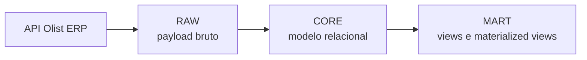

# Guia Executivo De Mapeamento Olist ERP -> Banco De Dados

Visão executiva do modelo de integração entre a API oficial do Olist ERP e o banco relacional no Supabase/PostgreSQL do projeto `Albertina`.

## Navegação

- [Objetivo](#objetivo)
- [Arquitetura Resumida](#arquitetura-resumida)
- [Cobertura Por Entidade](#cobertura-por-entidade)
- [Mapa Executivo Por Domínio](#mapa-executivo-por-domínio)
- [Padrão De Carga](#padrão-de-carga)
- [Leitura Analítica](#leitura-analítica)
- [Referência Técnica](#referência-técnica)

## Objetivo

Este guia responde três perguntas de gestão:

- quais dados do Olist ERP já estão mapeados para o banco;
- qual é o nível de cobertura de cada entidade;
- como o dado percorre as camadas `RAW`, `CORE` e `MART`.

## Arquitetura Resumida

## Cobertura Por Entidade

Legenda visual:

- `FULL [##########]` = cobertura alta
- `PARTIAL [######....]` = cobertura intermediária
- `LOW [###.......]` = cobertura inicial

| Entidade | Cobertura | Leitura Executiva | Risco Atual |
|---|---|---|---|
| Contatos | `FULL [########..]` | cadastro e identificação já bem mapeados | baixo |
| Pedidos | `FULL [#########.]` | principal entidade de venda está sólida | baixo |
| Produtos | `PARTIAL [######....]` | catálogo principal cobre o básico, mas variantes e tags ainda são parciais | médio |
| Notas fiscais | `PARTIAL [######....]` | listagem e vários campos fiscais já entram, porém detalhe ainda é parcial | médio |
| Contas a receber | `FULL [########..]` | título financeiro principal já está bem direcionado | baixo |
| Contas a pagar | `FULL [########..]` | título financeiro principal já está bem direcionado | baixo |
| Estoque | `PARTIAL [#####.....]` | modelo existe, mas endpoints finos ainda precisam fechamento final | médio |
| CRM | `LOW [###.......]` | estrutura prevista, com mais dependência de confirmação documental | alto |
| Expedição | `PARTIAL [#####.....]` | agrupamento confirmado; detalhe ainda parcial | médio |
| Separação | `PARTIAL [######....]` | rota principal confirmada; payload ainda incompleto | médio |
| Ordens de compra | `PARTIAL [#####.....]` | modelado no banco, ainda com detalhe parcial | médio |
| Ordens de serviço | `PARTIAL [#####.....]` | modelado no banco, ainda com detalhe parcial | médio |

## Mapa Executivo Por Domínio

| Domínio | Fonte Olist | Destino Operacional | Destino Analítico |
|---|---|---|---|
| Cadastros | `contatos`, `usuarios`, `vendedores`, `marcas`, `categorias` | `olist_core.contacts`, `olist_core.olist_users`, `olist_core.vendors`, `olist_core.brands`, `olist_core.categories` | `vw_dim_contacts`, `mv_dim_contacts` |
| Catálogo | `produtos`, `listas-precos`, `servicos` | `olist_core.products`, `olist_core.price_lists`, `olist_core.services` | `vw_dim_products`, `mv_dim_products` |
| Vendas | `pedidos` | `olist_core.orders` e filhas | `vw_fact_orders`, `mv_fact_orders`, `vw_fact_order_items`, `mv_fact_order_items` |
| Fiscal | `notas` | `olist_core.invoices` e filhas | uso analítico futuro |
| Financeiro | `contas a receber`, `contas a pagar` | `olist_core.accounts_receivable`, `olist_core.accounts_payable` e filhas | `vw_fact_receivables`, `mv_fact_receivables`, `vw_fact_payables`, `mv_fact_payables` |
| Logística | `formas-envio`, `estoque`, `expedicao`, `separacao` | `shipping_methods`, `stock_balances`, `shipment_groups`, `separations` | `vw_fact_inventory`, `mv_fact_inventory` |
| CRM e operações | `crm`, `ordens de compra`, `ordens de serviço` | `crm_*`, `purchase_orders`, `service_orders` | `vw_crm_pipeline`, `mv_crm_pipeline` |

## Padrão De Carga

| Etapa | Descrição |
|---|---|
| 1 | consumir endpoint Olist |
| 2 | persistir payload em `olist_raw.api_payloads` |
| 3 | normalizar em `olist_core.*` com `upsert` |
| 4 | atualizar visões em `olist_mart.vw_*` |
| 5 | executar refresh de `olist_mart.mv_*` quando necessário |

## Leitura Analítica

| Necessidade | Objeto |
|---|---|
| visão consolidada de pedidos | `olist_mart.mv_fact_orders` |
| visão por item vendido | `olist_mart.mv_fact_order_items` |
| visão de recebíveis | `olist_mart.mv_fact_receivables` |
| visão de pagáveis | `olist_mart.mv_fact_payables` |
| visão de estoque | `olist_mart.mv_fact_inventory` |
| visão de pipeline CRM | `olist_mart.mv_crm_pipeline` |

## Referência Técnica

- Guia técnico completo: [olist_mapping_guide.md](file:///c:/GitHubLocal/Albertina/docs/olist_mapping_guide.md)
- Matriz consolidada: [olist_mapping_matrix_consolidated.md](file:///c:/GitHubLocal/Albertina/docs/olist_mapping_matrix_consolidated.md)
- Guia de ETL: [olist_etl_guide.md](file:///c:/GitHubLocal/Albertina/docs/olist_etl_guide.md)
- DER: [olist_erp_der.md](file:///c:/GitHubLocal/Albertina/docs/olist_erp_der.md)
